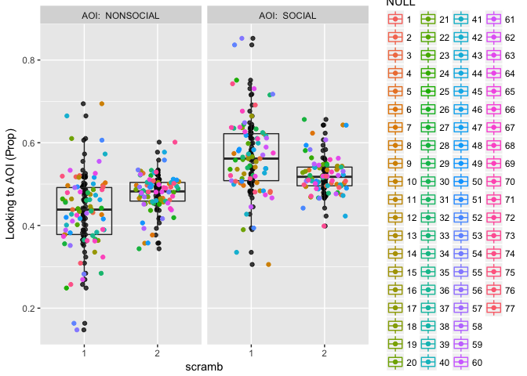
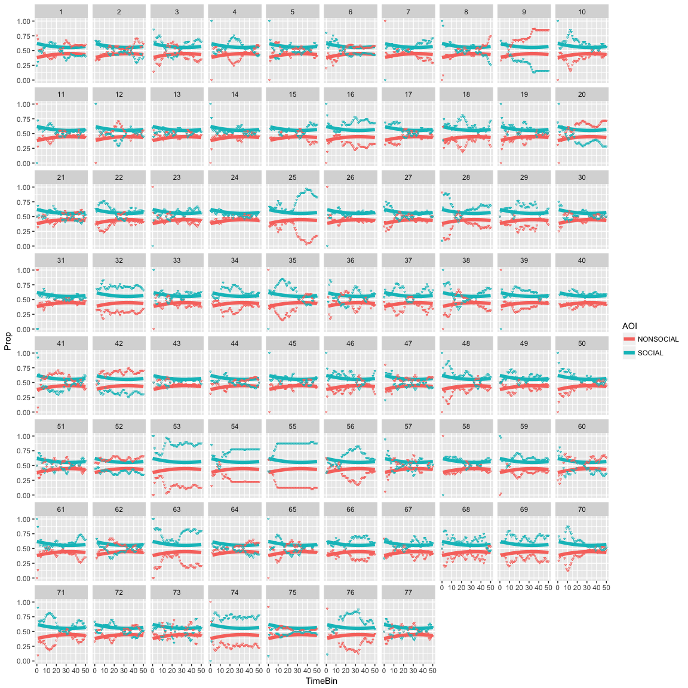
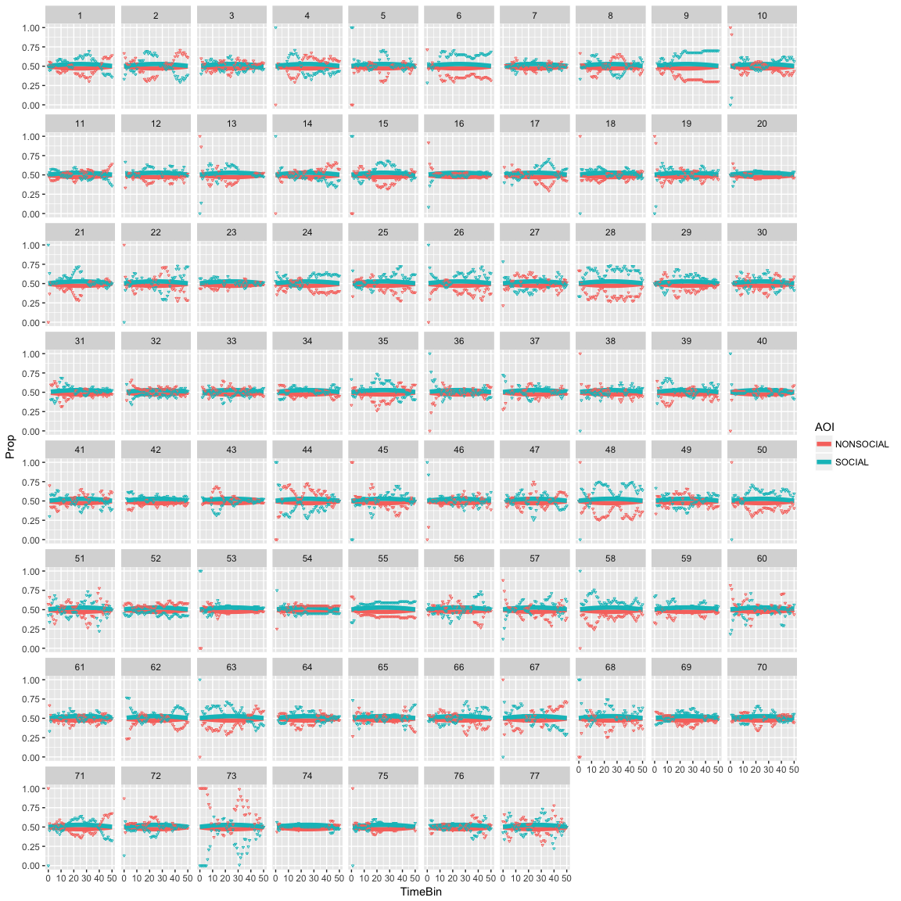
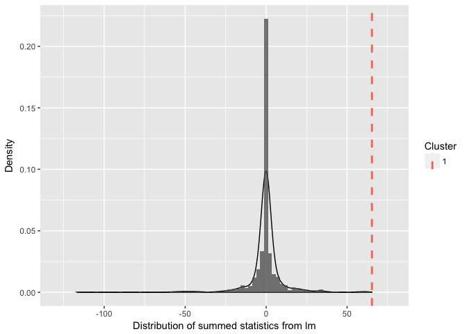
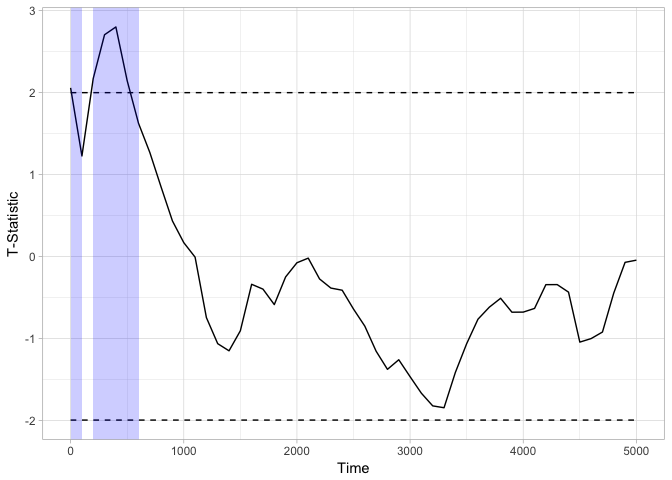

***
# Index

| Section | Description | Status |
| --- | --- | --- |
| [Window Analysis](#windowan) | Standard AOI analysis (no time dimension) | **Complete** |
| [Growth Curve Analysis](#growthcurve) | Model change in gaze bias over time | **Complete** |
| [Divergence Analysis](#divergence) | Apply tests to determine when predictors had an effect | **Complete** |
| [Switching Analysis](#switching) | Model swtiches from one AOI to another | **Complete** |
| [Individual differences](#indiff) | Look at relationship between individual random effects and EQ data | Incomplete |

Still to do:

1. Individual differences / EQ .
2. Classification of time-series (python).

***


## Import data into eyetrackingR format and add factors


```r
load('Workspace3.RData')
library(eyetrackingR)
data <- make_eyetrackingr_data(EXPDATA_FRAME_BIG, 
                               participant_column = "ps",
                               trial_column = "trial",
                               time_column = "samp",
                               aoi_columns = c('isinL','isinR',"SOCIAL","NONSOCIAL"),
                               treat_non_aoi_looks_as_missing = TRUE,trackloss_column="track")
```

```
## Converting Participants to proper type.
```

```
## Converting Trial to proper type.
```

```
## `mutate_each()` is deprecated.
## Use `mutate_all()`, `mutate_at()` or `mutate_if()` instead.
## To map `funs` over a selection of variables, use `mutate_at()`
```

```
## Warning: package 'bindrcpp' was built under R version 3.2.5
```

```r
data$scramb=factor(data$scramb)
data$X3=factor(data$X3,levels=c(1,2),labels=c("LeftSoc","Rightsoc"))
```

***

<a id='windowan'></a>

## Window analysis_plot

```r
library(ggplot2)
```

```
## Warning: package 'ggplot2' was built under R version 3.2.5
```

```r
response_window_agg_by_sub <- make_time_window_data(data, aois=c("SOCIAL","NONSOCIAL"),summarize_by = "ps",predictor_columns = c("scramb"))
```

```
## Analyzing SOCIAL...
```

```
## Analyzing NONSOCIAL...
```

```r
plot(response_window_agg_by_sub, predictor_column = "scramb")+geom_point(aes(colour=ps),position = position_jitter(w=0.3))
```

<!-- -->

## Window analysis_model

```r
library(lme4)
```

```
## Warning: package 'lme4' was built under R version 3.2.5
```

```
## Loading required package: Matrix
```

```r
library(afex)
```

```
## Warning: package 'afex' was built under R version 3.2.5
```

```
## Loading required package: lsmeans
```

```
## Warning: package 'lsmeans' was built under R version 3.2.5
```

```
## The 'lsmeans' package is being deprecated.
## Users are encouraged to switch to 'emmeans'.
## See help('transition') for more information, including how
## to convert 'lsmeans' objects and scripts to work with 'emmeans'.
```

```
## ************
## Welcome to afex. For support visit: http://afex.singmann.science/
```

```
## - Functions for ANOVAs: aov_car(), aov_ez(), and aov_4()
## - Methods for calculating p-values with mixed(): 'KR', 'S', 'LRT', and 'PB'
## - 'afex_aov' and 'mixed' objects can be passed to lsmeans() for follow-up tests
## - Get and set global package options with: afex_options()
## - Set orthogonal sum-to-zero contrasts globally: set_sum_contrasts()
## - For example analyses see: browseVignettes("afex")
## ************
```

```
## 
## Attaching package: 'afex'
```

```
## The following object is masked from 'package:lme4':
## 
##     lmer
```

```r
library(phia)
```

```
## Loading required package: car
```

```
## Warning: package 'car' was built under R version 3.2.5
```

```r
library(nlme)
```

```
## Warning: package 'nlme' was built under R version 3.2.5
```

```
## 
## Attaching package: 'nlme'
```

```
## The following objects are masked from 'package:lme4':
## 
##     lmList, sigma
```

```r
library(effects)
```

```
## Warning: package 'effects' was built under R version 3.2.5
```

```
## Loading required package: carData
```

```
## Warning: package 'carData' was built under R version 3.2.5
```

```
## 
## Attaching package: 'carData'
```

```
## The following objects are masked from 'package:car':
## 
##     Guyer, UN, Vocab
```

```
## lattice theme set by effectsTheme()
## See ?effectsTheme for details.
```

```r
# Set up model
model_window <- lmer(Prop ~ AOI*scramb + (1 | ps), data = response_window_agg_by_sub, REML = FALSE)

model_window_p = mixed(Prop ~ AOI*scramb+(1|ps), response_window_agg_by_sub)
```

```
## Contrasts set to contr.sum for the following variables: scramb, ps
```

```
## Fitting one lmer() model. [DONE]
## Calculating p-values. [DONE]
```

```r
# Get p values
model_window_p
```

```
## Mixed Model Anova Table (Type 3 tests, KR-method)
## 
## Model: Prop ~ AOI * scramb + (1 | ps)
## Data: response_window_agg_by_sub
##       Effect     df          F p.value
## 1        AOI 1, 228 105.02 ***  <.0001
## 2     scramb 1, 228       0.00    >.99
## 3 AOI:scramb 1, 228  29.60 ***  <.0001
## ---
## Signif. codes:  0 '***' 0.001 '**' 0.01 '*' 0.05 '+' 0.1 ' ' 1
```

```r
# Test interactions
testInteractions(model_window, fixed=c("scramb"), pairwise=c("AOI"),adjustment="holm")
```

```
## Chisq Test: 
## P-value adjustment method: holm
##                         Value Df  Chisq Pr(>Chisq)    
## NONSOCIAL-SOCIAL : 1 -0.13489  1 124.68  < 2.2e-16 ***
## NONSOCIAL-SOCIAL : 2 -0.04134  1  11.71  0.0006217 ***
## ---
## Signif. codes:  0 '***' 0.001 '**' 0.01 '*' 0.05 '.' 0.1 ' ' 1
```

There are main effects of AOI and an interaction between AOI and scramb. The effect of AOI is greater in the intact condition.

***
<a id='growthcurve'></a>

## Growth Curve analysis_plot


```r
response_time <- make_time_sequence_data(data, time_bin_size = 100,aois = c("NONSOCIAL","SOCIAL"),summarize_by = "ps",predictor_columns = c("scramb"))
```

```
## Analyzing NONSOCIAL...
```

```
## Warning in make_time_sequence_data(data = data, time_bin_size =
## time_bin_size, : With the current time-bin size, the final time-bin has a
## much smaller number of distinct samples than the other time-bins. Consider
## choosing a different time-bin size or using 'subset_by_window' to remove
## this portion of the trial.
```

```
## Analyzing SOCIAL...
```

```
## Warning in make_time_sequence_data(data = data, time_bin_size =
## time_bin_size, : With the current time-bin size, the final time-bin has a
## much smaller number of distinct samples than the other time-bins. Consider
## choosing a different time-bin size or using 'subset_by_window' to remove
## this portion of the trial.
```

```r
plot(response_time, predictor_column = "scramb")
```

```
## Warning: Removed 194 rows containing non-finite values (stat_summary).
```

```
## Warning: Removed 194 rows containing non-finite values (stat_summary).
```

<!-- -->


## Growth Curve analysis_model

Since we are dealing with mutliple interactions with multiple higher-order polynomials, I think it is justified to fit a model independently to scrambled and intact stimuli, to improve interpretation.

### Intact

```r
# Just AOI factor
model_time_sequence_intact1 <- lmer(Prop ~ AOI+(1|ps),data = response_time[response_time$scramb==1,], REML = FALSE)
# Linear
model_time_sequence_intact2 <- lmer(Prop ~ AOI*(ot1)+(1 + ot1 |ps),data = response_time[response_time$scramb==1,], REML = FALSE)
# Linear + quadratic
model_time_sequence_intact3 <- lmer(Prop ~ AOI*(ot1+ot2)+(1 + ot1 + ot2 |ps),data = response_time[response_time$scramb==1,], REML = FALSE)
# Linear + quadratic + cubic
model_time_sequence_intact4 <- lmer(Prop ~ AOI*(ot1+ot2+ot3)+(1+ ot1 + ot2 + ot3 |ps),data = response_time[response_time$scramb==1,], REML = FALSE)

anova(model_time_sequence_intact1,model_time_sequence_intact2)
```

```
## Data: response_time[response_time$scramb == 1, ]
## Models:
## model_time_sequence_intact1: Prop ~ AOI + (1 | ps)
## model_time_sequence_intact2: Prop ~ AOI * (ot1) + (1 + ot1 | ps)
##                             Df     AIC     BIC logLik deviance  Chisq
## model_time_sequence_intact1  4 -9164.4 -9136.6 4586.2  -9172.4       
## model_time_sequence_intact2  8 -9246.6 -9190.9 4631.3  -9262.6 90.137
##                             Chi Df Pr(>Chisq)    
## model_time_sequence_intact1                      
## model_time_sequence_intact2      4  < 2.2e-16 ***
## ---
## Signif. codes:  0 '***' 0.001 '**' 0.01 '*' 0.05 '.' 0.1 ' ' 1
```

```r
anova(model_time_sequence_intact2,model_time_sequence_intact3)
```

```
## Data: response_time[response_time$scramb == 1, ]
## Models:
## model_time_sequence_intact2: Prop ~ AOI * (ot1) + (1 + ot1 | ps)
## model_time_sequence_intact3: Prop ~ AOI * (ot1 + ot2) + (1 + ot1 + ot2 | ps)
##                             Df     AIC     BIC logLik deviance  Chisq
## model_time_sequence_intact2  8 -9246.6 -9190.9 4631.3  -9262.6       
## model_time_sequence_intact3 13 -9293.1 -9202.6 4659.5  -9319.1 56.492
##                             Chi Df Pr(>Chisq)    
## model_time_sequence_intact2                      
## model_time_sequence_intact3      5  6.434e-11 ***
## ---
## Signif. codes:  0 '***' 0.001 '**' 0.01 '*' 0.05 '.' 0.1 ' ' 1
```

```r
anova(model_time_sequence_intact3,model_time_sequence_intact4)
```

```
## Data: response_time[response_time$scramb == 1, ]
## Models:
## model_time_sequence_intact3: Prop ~ AOI * (ot1 + ot2) + (1 + ot1 + ot2 | ps)
## model_time_sequence_intact4: Prop ~ AOI * (ot1 + ot2 + ot3) + (1 + ot1 + ot2 + ot3 | ps)
##                             Df     AIC     BIC logLik deviance  Chisq
## model_time_sequence_intact3 13 -9293.1 -9202.6 4659.5  -9319.1       
## model_time_sequence_intact4 19 -9283.4 -9151.2 4660.7  -9321.4 2.3492
##                             Chi Df Pr(>Chisq)
## model_time_sequence_intact3                  
## model_time_sequence_intact4      6     0.8849
```


This indicates that best fitting model is linear + quadratic - so check that a model with just the quadratic component isn't better


```r
model_time_sequence_intact5 <- lmer(Prop ~ AOI*(ot2)+(1 + ot2|ps),data = response_time[response_time$scramb==1,], REML = FALSE)

anova(model_time_sequence_intact3,model_time_sequence_intact5)
```

```
## Data: response_time[response_time$scramb == 1, ]
## Models:
## model_time_sequence_intact5: Prop ~ AOI * (ot2) + (1 + ot2 | ps)
## model_time_sequence_intact3: Prop ~ AOI * (ot1 + ot2) + (1 + ot1 + ot2 | ps)
##                             Df     AIC     BIC logLik deviance  Chisq
## model_time_sequence_intact5  8 -9206.5 -9150.8 4611.2  -9222.5       
## model_time_sequence_intact3 13 -9293.1 -9202.6 4659.5  -9319.1 96.571
##                             Chi Df Pr(>Chisq)    
## model_time_sequence_intact5                      
## model_time_sequence_intact3      5  < 2.2e-16 ***
## ---
## Signif. codes:  0 '***' 0.001 '**' 0.01 '*' 0.05 '.' 0.1 ' ' 1
```


Model 3 is best fitting, so plot this.


```r
plot(response_time[response_time$scramb==1,], predictor_column = c("AOI"), dv = "Prop", model = model_time_sequence_intact3) +theme_light()
```

```
## Warning: Removed 88 rows containing non-finite values (stat_summary).

## Warning: Removed 88 rows containing non-finite values (stat_summary).
```

<!-- -->

### Scrambled


```r
# AOI
model_time_sequence_scramb1 <- lmer(Prop ~ AOI+(1|ps),data = response_time[response_time$scramb==2,], REML = FALSE)
# AOI + linear
model_time_sequence_scramb2 <- lmer(Prop ~ AOI*(ot1)+(1 +ot1| ps),data = response_time[response_time$scramb==2,], REML = FALSE)
# AOI + linear + quadratic
model_time_sequence_scramb3 <- lmer(Prop ~ AOI*(ot1+ot2)+(1 + ot1 + ot2 |ps),data = response_time[response_time$scramb==2,], REML = FALSE)

anova(model_time_sequence_scramb1,model_time_sequence_scramb2)
```

```
## Data: response_time[response_time$scramb == 2, ]
## Models:
## model_time_sequence_scramb1: Prop ~ AOI + (1 | ps)
## model_time_sequence_scramb2: Prop ~ AOI * (ot1) + (1 + ot1 | ps)
##                             Df    AIC    BIC logLik deviance  Chisq Chi Df
## model_time_sequence_scramb1  4 -13753 -13725 6880.3   -13761              
## model_time_sequence_scramb2  8 -13748 -13692 6881.8   -13764 2.8656      4
##                             Pr(>Chisq)
## model_time_sequence_scramb1           
## model_time_sequence_scramb2     0.5806
```

```r
anova(model_time_sequence_scramb1,model_time_sequence_scramb3)
```

```
## Data: response_time[response_time$scramb == 2, ]
## Models:
## model_time_sequence_scramb1: Prop ~ AOI + (1 | ps)
## model_time_sequence_scramb3: Prop ~ AOI * (ot1 + ot2) + (1 + ot1 + ot2 | ps)
##                             Df    AIC    BIC logLik deviance  Chisq Chi Df
## model_time_sequence_scramb1  4 -13753 -13725 6880.3   -13761              
## model_time_sequence_scramb3 13 -13784 -13694 6905.2   -13810 49.614      9
##                             Pr(>Chisq)    
## model_time_sequence_scramb1               
## model_time_sequence_scramb3  1.273e-07 ***
## ---
## Signif. codes:  0 '***' 0.001 '**' 0.01 '*' 0.05 '.' 0.1 ' ' 1
```


Linear + quadratic improves - but linear itself did not - is quadratic better than linear + quadratic?


```r
model_time_sequence_scramb4 <- lmer(Prop ~ AOI*(ot2)+(1|ps),data = response_time[response_time$scramb==2,], REML = FALSE)
anova(model_time_sequence_scramb4,model_time_sequence_scramb3)
```

```
## Data: response_time[response_time$scramb == 2, ]
## Models:
## model_time_sequence_scramb4: Prop ~ AOI * (ot2) + (1 | ps)
## model_time_sequence_scramb3: Prop ~ AOI * (ot1 + ot2) + (1 + ot1 + ot2 | ps)
##                             Df    AIC    BIC logLik deviance  Chisq Chi Df
## model_time_sequence_scramb4  6 -13794 -13752 6903.1   -13806              
## model_time_sequence_scramb3 13 -13784 -13694 6905.2   -13810 4.1225      7
##                             Pr(>Chisq)
## model_time_sequence_scramb4           
## model_time_sequence_scramb3     0.7656
```


Yes it is, so model 4 is best fitting (cubic term, but no linear term)


```r
plot(response_time[response_time$scramb==2,], predictor_column = c("AOI"), dv = "Prop", model = model_time_sequence_scramb4) +theme_light()
```

```
## Warning: Removed 106 rows containing non-finite values (stat_summary).

## Warning: Removed 106 rows containing non-finite values (stat_summary).
```

<!-- -->

***

<a id='divergence'></a>

## Divergence analysis

What time bins are significantly different from one another?

Because of the weird eyetrackingR synntax, we need to restructure the data slightly so that we can investigate the main effect of AOI. So we instead look at whether the observer was looking into the left or right AOI as a function of where the social image was (left or right).

### Intact condition

```r
response_time2 <- make_time_sequence_data(data, time_bin_size = 100,aois = c("isinL","isinR"),summarize_by = "ps",predictor_columns = c("scramb","X3"))
```

```
## Analyzing isinL...
```

```
## Warning in make_time_sequence_data(data = data, time_bin_size =
## time_bin_size, : With the current time-bin size, the final time-bin has a
## much smaller number of distinct samples than the other time-bins. Consider
## choosing a different time-bin size or using 'subset_by_window' to remove
## this portion of the trial.
```

```
## Analyzing isinR...
```

```
## Warning in make_time_sequence_data(data = data, time_bin_size =
## time_bin_size, : With the current time-bin size, the final time-bin has a
## much smaller number of distinct samples than the other time-bins. Consider
## choosing a different time-bin size or using 'subset_by_window' to remove
## this portion of the trial.
```

```r
# X3 codes where the social image was.
response_time2$side=factor(response_time2$X3)

# When does the observer look significantly more at the social AOI ? (holm adjustment)
tb_analysis_INT <- analyze_time_bins(data = response_time2[response_time2$scramb==1,],test = "t.test",aoi=c("isinL"),predictor_column =c("side"),  alpha = .05,p_adjust_method = 'holm')
```

```
## Computing t.test for each time bin...
```

```r
plot(tb_analysis_INT)
```

<!-- -->

```r
summary(tb_analysis_INT)
```

```
## Test Type:	 t.test 
## Predictor:	 side 
## Formula:	 Prop ~ side 
## Runs of Significant Time Bins: 
## Positive Run 1  ===== 
## 	Time:		 100 - 5100
```

For intact images, the bias for social images is present in every time bin from 100 onwards

### Scrambled condition


```r
tb_analysis_SCR <- analyze_time_bins(data = response_time2[response_time2$scramb==2,],test = "t.test",aoi=c("isinL"),predictor_column =c("side"),  alpha = .05,p_adjust_method = 'holm')
```

```
## Computing t.test for each time bin...
```

```r
plot(tb_analysis_SCR)
```

<!-- -->

```r
summary(tb_analysis_SCR)
```

```
## Test Type:	 t.test 
## Predictor:	 side 
## Formula:	 Prop ~ side 
## Runs of Significant Time Bins:
```

For scrambled images, the bias for social images is not significant in any time bin after adjusting for multiple comparisons.


### Intact v scrambled condition


```r
tb_analysis <- analyze_time_bins(data = response_time,test = "t.test",aoi=c("SOCIAL"),predictor_column =c("scramb"),  alpha = .05,p_adjust_method = 'holm')
```

```
## Computing t.test for each time bin...
```

```r
plot(tb_analysis, type = "estimate") + theme_light()
```

<!-- -->

```r
summary(tb_analysis)
```

```
## Test Type:	 t.test 
## Predictor:	 scramb 
## Formula:	 Prop ~ scramb 
## Runs of Significant Time Bins: 
## Positive Run 1  ===== 
## 	Time:		 200 - 1400
```

In terms of preference for the social image, intact images diverge from the scrambled images in the time bins 200-1400 ms

*** 

<a id='switching'></a>

## Switching analysis

Divide trials into which AOI participants started on. Calculate swtiches away from this AOI using a rolling wondow

```r
onsets <- make_onset_data(data, onset_time = 100, fixation_window_length=100,target_aoi='SOCIAL',distractor_aoi = 'NONSOCIAL')
```

```
## Warning in make_onset_data(data, onset_time = 100, fixation_window_length = 100, : Smoothing in make_onset_data() using fixation_window_length_rows is experimental. We
##             recommend looking closely at the output to validate it.
```

```
## Warning in make_onset_data(data, onset_time = 100, fixation_window_length
## = 100, : Very few trials have a legitimate first AOI! Possible incorrect
## onset time?
```

```r
plot(onsets,predictor_columns="scramb")
```

<!-- -->

```r
onset_switches <- make_switch_data(onsets,predictor_columns = "scramb")

# Visualize subject's switch times
plot(onset_switches,predictor_columns="scramb")
```

```
## Warning: Removed 28 rows containing non-finite values (stat_boxplot).
```

```
## Warning: Removed 28 rows containing missing values (geom_point).
```

<!-- -->


Now enter this data into a model


```r
model_switches <- lmer(FirstSwitch ~ FirstAOI*scramb + (1 | ps), data=onset_switches, REML=FALSE)
model_switches_p = mixed(FirstSwitch ~ FirstAOI*scramb+(1|ps), onset_switches)
```

```
## Contrasts set to contr.sum for the following variables: FirstAOI, scramb, ps
```

```
## Warning in mixed(FirstSwitch ~ FirstAOI * scramb + (1 | ps),
## onset_switches): Due to missing values, reduced number of observations to
## 1042
```

```
## Warning in mixed(FirstSwitch ~ FirstAOI * scramb + (1 | ps),
## onset_switches): Due to missing values, set_data_arg set to FALSE.
```

```
## Fitting one lmer() model.
```

```
## Warning: contrasts dropped from factor ps due to missing levels
```

```
## Warning: contrasts dropped from factor ps due to missing levels
```

```
## [DONE]
## Calculating p-values.
```

```
## Warning: contrasts dropped from factor ps due to missing levels

## Warning: contrasts dropped from factor ps due to missing levels
```

```
## [DONE]
```

```r
model_switches_p
```

```
## Mixed Model Anova Table (Type 3 tests, KR-method)
## 
## Model: FirstSwitch ~ FirstAOI * scramb + (1 | ps)
## Data: onset_switches
##            Effect         df         F p.value
## 1        FirstAOI  1, 997.44 32.16 ***  <.0001
## 2          scramb 1, 1006.37      2.68     .10
## 3 FirstAOI:scramb 1, 1003.33 11.97 ***   .0006
## ---
## Signif. codes:  0 '***' 0.001 '**' 0.01 '*' 0.05 '+' 0.1 ' ' 1
```


Main effect of First AOI and an interaction bewteen first AOI and scramble. Now unpick the interaction.


```r
testInteractions(model_switches, fixed=c("scramb"), pairwise=c("FirstAOI"),adjustment="holm")
```

```
## Chisq Test: 
## P-value adjustment method: holm
##                        Value Df   Chisq Pr(>Chisq)    
## NONSOCIAL-SOCIAL : 1 -408.91  1 48.9763  5.181e-12 ***
## NONSOCIAL-SOCIAL : 2  -97.55  1  2.0726       0.15    
## ---
## Signif. codes:  0 '***' 0.001 '**' 0.01 '*' 0.05 '.' 0.1 ' ' 1
```

Observers take longer to switch from the social AOI, but this effect is only significant in the intact condition.

***

<a id='indiff'></a>

## Individual Differences

### Visualise individual data (intact)

```r
response_time_mod_in=cbind(response_time[response_time$scramb==1 & !is.na(response_time$Prop),],predict(model_time_sequence_intact3))

colnames(response_time_mod_in)=c(colnames(response_time),"pred")

ggplot(response_time_mod_in[response_time_mod_in$scramb==1,],aes(x=TimeBin,y=Prop))+facet_wrap(~ps,nrow=8)+geom_line(aes(x=TimeBin,y=pred,colour=AOI),size=2,linetype="solid")+geom_point(aes(colour=AOI),size=0.5,shape=6)
```

<!-- -->


### Scrambled


```r
response_time_mod_sc=cbind(response_time[response_time$scramb==2 & !is.na(response_time$Prop),],predict(model_time_sequence_scramb4))

colnames(response_time_mod_sc)=c(colnames(response_time),"pred")

ggplot(response_time_mod_sc[response_time_mod_sc$scramb==2,],aes(x=TimeBin,y=Prop))+facet_wrap(~ps,nrow=8)+geom_line(aes(x=TimeBin,y=pred,colour=AOI),size=2)+geom_point(aes(colour=AOI),size=0.5,shape=6)
```

<!-- -->

### Plot linear and quadratic random effects


```r
gh=data.frame()
# Plot fixed effects
getrand=function(model){
for (sub in 1:77){
linear=ranef(model)$ps$ot1[sub]*response_time$ot1[1:50]
quadratic=ranef(model)$ps$ot2[sub]*response_time$ot2[1:50]
modellin=fixef(model)[3]*response_time$ot1[1:50]
modelquad=fixef(model)[4]*response_time$ot2[1:50]
modfull=modellin+modelquad
indfull=linear+quadratic
timebin=response_time$TimeBin[1:50]
gh=data.frame(rbind(cbind(sub,timebin,linear,quadratic,modellin,modelquad,modfull,indfull),gh))
}
  return(gh)
}

curvesIN=getrand(model_time_sequence_intact3)
curvesSC=getrand(model_time_sequence_scramb3)

curvesall=rbind(curvesIN,curvesSC)
curvesall$scramb=rep(c(1,2),each=3850)
curvesall$scramb=factor(curvesall$scramb,levels=c(1,2),labels=c("intact","scrambled"))

ggplot(curvesall,aes(x=timebin,y=indfull))+facet_wrap(~sub,nrow=8)+geom_point(aes(colour=scramb))
```

<!-- -->

### Load in the EQ Data


```r
EQ_DATA=read.csv('EQ_Data.csv')
EQ=EQ_DATA$EQ.Total
EQS=EQ_DATA$EQ.Social
EQE=EQ_DATA$EQ.Emotion
EQC=EQ_DATA$EQ.Cognitive

library(stringr)
```

```
## Warning: package 'stringr' was built under R version 3.2.5
```

```r
# EQ data doesnt belong to everyone (only 69 people)
EQ_PS=as.numeric(str_extract(EQ_DATA$pps, "[0-9]+"))
```

### Perform a Bootstrapped cluster-based permutation analysis


```r
# Define threshold based on alpha = .05 (two tailed)
num_sub = length(unique((EQ_PS)))
threshold_t = qt(p = 1 - .05/2, df = num_sub-1)

response_time_new <- make_time_sequence_data(data, time_bin_size = 100,aois = c("SOCIAL"),predictor_columns = c("scramb"),summarize_by="ps")
```

```
## Warning in make_time_sequence_data(data, time_bin_size = 100, aois =
## c("SOCIAL"), : With the current time-bin size, the final time-bin has a
## much smaller number of distinct samples than the other time-bins. Consider
## choosing a different time-bin size or using 'subset_by_window' to remove
## this portion of the trial.
```

```r
response_time_new$EQ=rep(NA,nrow(response_time_new))

# Add EQ data. Here I add the 'Social' subscale (no effects are detected for other sub-scales, or for total EQ score)
for (sub in 1:length(EQ_PS)-1){
  response_time_new[response_time_new$ps==EQ_PS[sub],]$EQ=EQS[sub]
}

# Intact images, look for the effect of EQS in each time bin
df_timeclust_between <- make_time_cluster_data(response_time_new[response_time_new$scramb==1,], test= "lm",predictor_column = "EQ", threshold = threshold_t)

plot(df_timeclust_between) +  ylab("T-Statistic") + theme_light()
```

<!-- -->

There are 3 clusters. Perform a bootstrapping analysis to see if these could have been obtained by chance. 


```r
clust_analysis_between <- analyze_time_clusters(df_timeclust_between, within_subj = FALSE, samples=1000)
```

```
## Install package 'pbapply' for a progress bar in this function.
```

```r
summary(clust_analysis_between)
```

```
## Test Type:	 lm 
## Predictor:	 EQ 
## Formula:	 Prop ~ EQ 
## Null Distribution   ====== 
##  Mean:		 -0.4788 
##  2.5%:		 -21.2021 
## 97.5%:		 14.4226 
## Summary of Clusters ======
##   Cluster Direction SumStatistic StartTime EndTime Probability
## 1       1  Positive     6.729117       700    1000       0.160
## 2       2  Positive     8.717798      3400    3800       0.126
## 3       3  Positive    24.567173      4200    5100       0.030
```

```r
plot(clust_analysis_between)
```

<!-- -->

Only the last cluster is significant after the permutation test. The social component of the EQ predicts enhanced gaze towards the end of the trial 4200ms onwards (p=.047).

As a sanity check, I also applied the same tests for scrambled images and found no effects.

### See whether the random effects for the linear and quadratic terms of the growthcurve model are related to empathy.


```r
linear=rep(0,68)
for (sub in 1:length(EQ_PS)-1){
  linear[sub]=ranef(model_time_sequence_intact3)$ps$ot2[sub]
}
```


